
**Packages**

``` r
library(tidyverse)
library(tidytext)
library(tm)
library(textstem)
library(qdapRegex)
library(DataExplorer)
library(mlr)
library(mlrMBO)
library(parallel)
library(parallelMap)
library(textclean)
library(readr)
library(wordcloud)
library(drlib)
library(gridExtra)
library(parallelMap)
library(textcat)
library(woeBinning)
library(knitr)
library(reshape2)
```

1 Introduction
==============

This notebook is a solution for the "Fake News" competition from Kaggle.com. The goal is to generate a system to identify unreliable news articles. The model scored an accuracy of 99% on the unseen test set which was the 1st place at the leaderboard at the time.

The data includes th following variables:

-   id: unique id for a news article.
-   title: the title of a news article.
-   author: author of the news article.
-   text: the text of the article.
-   label: a label that marks the article as unreliable (1: unreliable 0: reliable).

2 Reading data
==============

``` r
train =  read.csv("C:/Users/X1/Downloads/train (4).csv", 
                  stringsAsFactors = FALSE,
                  encoding = "UTF-8", 
                  na.strings = c("", " "))


test =  read.csv("C:/Users/X1/Downloads/test (3).csv", 
                 encoding = "UTF-8", 
                 stringsAsFactors = FALSE,
                 na.strings = c("", " "))
```

First, I merge the train and the test data and add the target label to the test data.

``` r
test$label = 0 

full = bind_rows(train, test)
```

3 Data cleaning
===============

**Overview**

``` r
glimpse(full)
```

    ## Observations: 26,000
    ## Variables: 5
    ## $ id     <int> 0, 1, 2, 3, 4, 5, 6, 7, 8, 9, 10, 11, 12, 13, 14, 15, 1...
    ## $ title  <chr> "House Dem Aide: We Didn’t Even See Comey’s Letter Unti...
    ## $ author <chr> "Darrell Lucus", "Daniel J. Flynn", "Consortiumnews.com...
    ## $ text   <chr> "House Dem Aide: We Didn’t Even See Comey’s Letter Unti...
    ## $ label  <dbl> 1, 0, 1, 1, 1, 0, 1, 0, 0, 0, 0, 0, 1, 1, 1, 0, 0, 1, 1...

**Missing values**

There are some missing values in text and author.

``` r
plot_missing(full, ggtheme = theme_minimal())
```

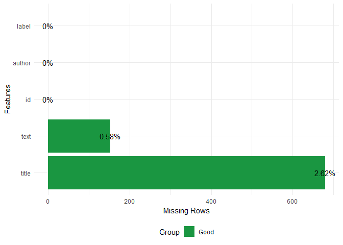

I replace these missing values with "missing".

``` r
full[is.na(full)] = "missing"
```

3 EDA
=====

**label**

The target variable is evenly distributed (i.e. there is the same amount of reliable and unreliable articles in the training set).

``` r
full %>%
  slice(1:nrow(train)) %>%
  group_by(label) %>%
  summarise(n = n()) %>%
  mutate(freq = n /sum(n)) %>%
  kable("html")
```

<table>
<thead>
<tr>
<th style="text-align:right;">
label
</th>
<th style="text-align:right;">
n
</th>
<th style="text-align:right;">
freq
</th>
</tr>
</thead>
<tbody>
<tr>
<td style="text-align:right;">
0
</td>
<td style="text-align:right;">
10387
</td>
<td style="text-align:right;">
0.499375
</td>
</tr>
<tr>
<td style="text-align:right;">
1
</td>
<td style="text-align:right;">
10413
</td>
<td style="text-align:right;">
0.500625
</td>
</tr>
</tbody>
</table>

**languages**

Let´s check what kind of languages we are dealing with. For this task, I determine the language of the title.

``` r
languages = textcat(full$title)
```

Then. I add them to the data. For unknown languages (NA), I impute "missing".

``` r
full$language = languages


full$language[is.na(full$language)] = "missing"
```

As you can see, the most common languages are English and German.

``` r
full %>%
  group_by(language) %>%
  summarise(n = n()) %>%
  arrange(-n) %>%
  head() %>%
  kable("html")
```

<table>
<thead>
<tr>
<th style="text-align:left;">
language
</th>
<th style="text-align:right;">
n
</th>
</tr>
</thead>
<tbody>
<tr>
<td style="text-align:left;">
english
</td>
<td style="text-align:right;">
15885
</td>
</tr>
<tr>
<td style="text-align:left;">
german
</td>
<td style="text-align:right;">
2403
</td>
</tr>
<tr>
<td style="text-align:left;">
scots
</td>
<td style="text-align:right;">
1802
</td>
</tr>
<tr>
<td style="text-align:left;">
catalan
</td>
<td style="text-align:right;">
1202
</td>
</tr>
<tr>
<td style="text-align:left;">
middle\_frisian
</td>
<td style="text-align:right;">
1079
</td>
</tr>
<tr>
<td style="text-align:left;">
danish
</td>
<td style="text-align:right;">
901
</td>
</tr>
</tbody>
</table>

Now I take a look, which languages are associated with unreliable news articles. As you can see, only a few languages are clearly associated with reliable news articles.

``` r
summary_language = full %>% slice(1:nrow(train)) %>% 
  Rmisc::summarySE(measurevar="label", groupvars=c("language"))

  
summary_language %>%
  mutate(language = reorder(language, -label)) %>%
  ggplot(aes(x = language, y = label)) +
  geom_bar(stat = "identity") +
  theme_minimal() +
  theme(axis.text.x = element_text(angle = 60, hjust = 1)) +
  labs(y = "probability", title = "Probability for unreliable news articles by language") +
  geom_hline(yintercept = 0.5, linetype= "dashed", color = "darkred")
```

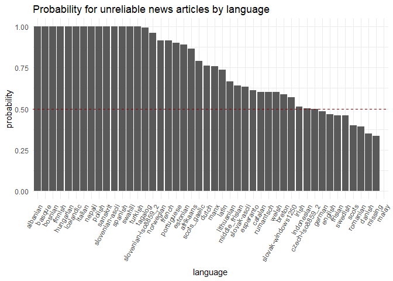

**title**

Let´s check, what kind of words are in the tile in general.

``` r
full %>%
  slice(1:nrow(train)) %>%
  select(title, label) %>%
  unnest_tokens(word, title) %>%
  anti_join(stop_words, by = "word") %>%
  filter(str_detect(word, "[:alpha:]")) %>% 
  count(word) %>%
  arrange(-n) %>%
  with(wordcloud(word, n, 
                 random.order = FALSE, 
                 max.words = 300, 
                 colors = brewer.pal(8,"Dark2")))
```

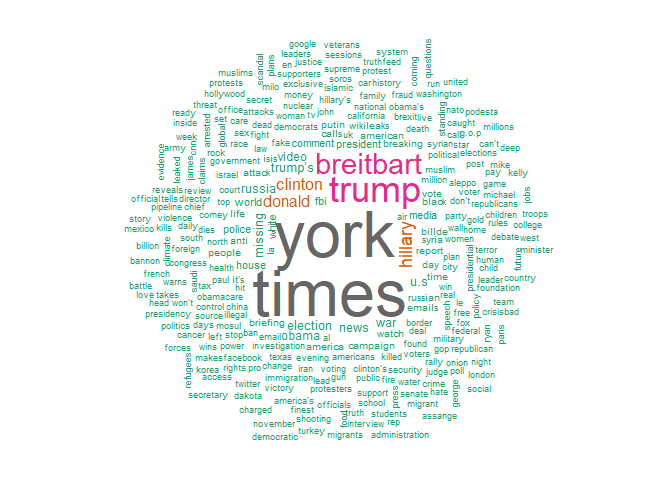

Now, I check which words are most common in each class.

``` r
full %>%
  slice(1:nrow(train)) %>%
  select(title, label) %>%
  unnest_tokens(word, title) %>%
  anti_join(stop_words, by = "word") %>%
  filter(str_detect(word, "[:alpha:]")) %>%
  group_by(label) %>%
  count(word) %>%
  top_n(10, n) %>%
  ungroup() %>%
  mutate(label = as.factor(label)) %>%
  ggplot(aes(reorder_within(word, n, label), n, fill = label)) +
  geom_bar(stat = "identity") +
  facet_wrap(~label, scales = "free") +
  scale_x_reordered() +
  coord_flip() +
  theme_minimal() +
  scale_fill_brewer(palette = "Dark2") +
  labs(x = NULL, y = NULL, title = "Top 10 words per class in the title")
```

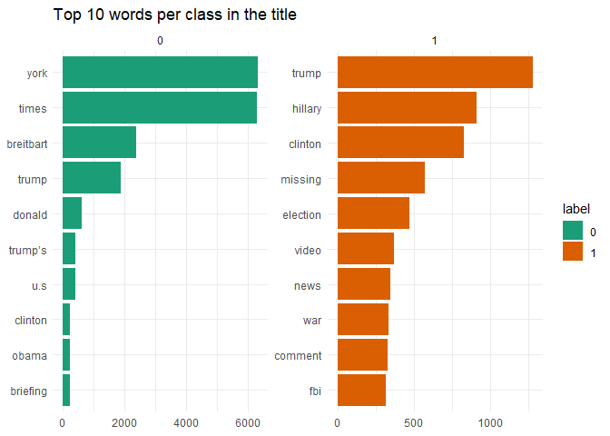

It´s also interesting if the length of the title has an influence on the target variable. As you can see, unreliable articles have a generally shorter title than reliable ones.

``` r
full %>%
  slice(1:nrow(train)) %>%
  mutate(title = nchar(title)) %>%
  mutate(label = as.factor(label)) %>%
  ggplot(aes(x = title, color = label)) +
  geom_density() +
  theme_minimal() +
  scale_color_brewer(palette = "Dark2") +
  labs(title = "Title length per class")
```

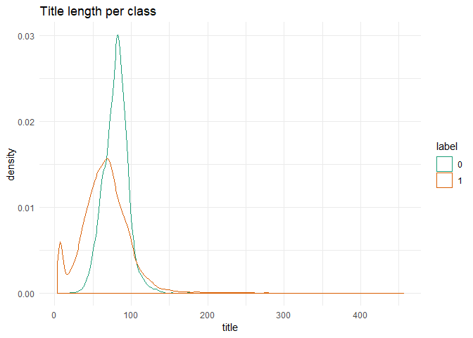

**autor**

Overall, there are 4202 distinct authors in the data.

``` r
full %>%
  slice(1:nrow(train)) %>%
  distinct(author) %>%
  count() %>%
  kable("html")
```

<table>
<thead>
<tr>
<th style="text-align:right;">
n
</th>
</tr>
</thead>
<tbody>
<tr>
<td style="text-align:right;">
4202
</td>
</tr>
</tbody>
</table>
Let´s check how the authors are distributed over different classes. "Pam Key" is very common on reliable articles whereby "nan" is common on unreliable articles.

``` r
full %>%
  slice(1:nrow(train)) %>%
  group_by(author, label) %>%
  summarise(n = n()) %>%
  group_by(label) %>%
  arrange(-n) %>%
  top_n(20, n) %>%
  ungroup() %>%
  mutate(label = as.factor(label)) %>%
  ggplot(aes(reorder_within(author, n, label), n, fill = label)) +
  geom_bar(stat = "identity") +
  facet_wrap(~label, scales = "free", drop = TRUE) +
  scale_x_reordered() +
  theme_minimal() +
  scale_fill_brewer(palette = "Dark2") +
  labs(x = NULL, y = NULL, fill = "label", title = "Common authors per class") +
  theme(axis.text.x = element_text(angle = 45, hjust = 1)) 
```

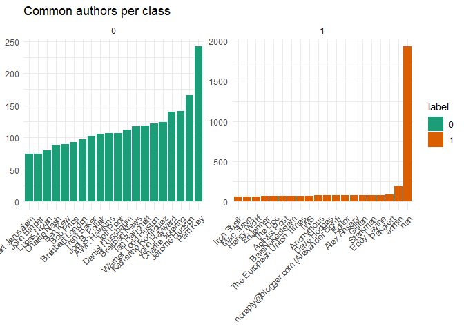

**text**

As I did in the title, I look which kind of words are in the text.

``` r
full %>%
  slice(1:nrow(train)) %>%
  select(text, label) %>%
  unnest_tokens(word, text) %>%
  anti_join(stop_words, by = "word") %>%
  filter(str_detect(word, "[:alpha:]")) %>% 
  count(word) %>%
  arrange(-n) %>%
  with(wordcloud(word, n, 
                 random.order = FALSE, 
                 max.words = 500, 
                 scale = c(4,0.1), 
                 colors = brewer.pal(8,"Dark2")))
```

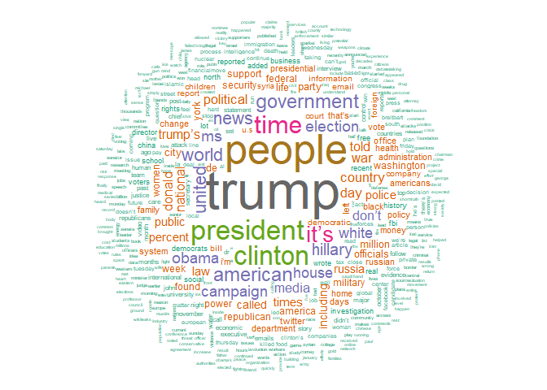

I also want to know which kind of words are assiciated with each class.

``` r
full %>%
  slice(1:nrow(train)) %>%
  select(text, label) %>%
  unnest_tokens(word, text) %>%
  anti_join(stop_words, by = "word") %>%
  filter(str_detect(word, "[:alpha:]")) %>%
  group_by(label) %>%
  count(word) %>%
  top_n(10, n) %>%
  ggplot(aes(reorder_within(word, n, label), n, fill = as.factor(label))) +
  geom_bar(stat = "identity") +
  facet_wrap(~label, scales = "free") +
  scale_x_reordered() +
  coord_flip() +
  theme_minimal() +
  scale_fill_brewer(palette = "Dark2") +
  labs(x = NULL, y = NULL, fill = "label", title = "Top 10 words per class in text")
```

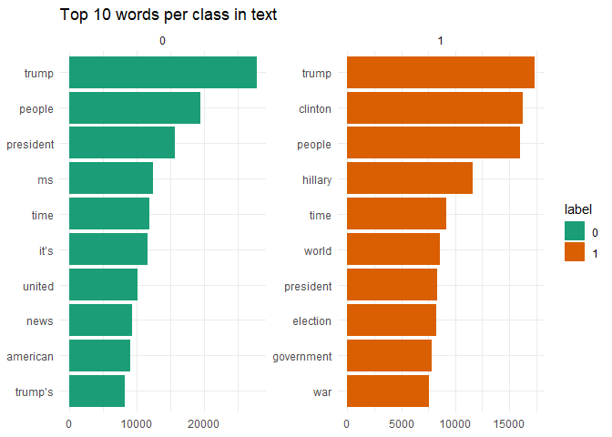

4 Preprocessing/Feature Engeneering
===================================

After I got an initial feel for the data the data will be preprocessed for modeling. Following preprocessing, steps will be done for title and text.

-   Replacing HTML-tags with their meaning
-   Removing non\_ascii characters
-   Replacing contractions
-   Removing English and German stopwords
-   Removing special characters and numbers
-   Lowercasing
-   Lemmatizing
-   Removing terms with less than 2 characters
-   Striping the whitespace

**language**

Since we have lots of languages in the data I will bin them using WOE-Binning to avoid overfitting.

``` r
full_language = full %>% 
  select(label, language) %>%
  mutate(language = as.factor(language)) 


language_binned = woe.tree.binning(full_language[1:nrow(train),], 
                                   'label', 
                                   'language', 
                                   stop.limit = 0.05, 
                                   min.perc.class = 0.05, 
                                   abbrev.fact.levels = 10,
                                   event.class = 1)


full_language_binned = woe.binning.deploy(full_language, language_binned)
```

``` r
woe.binning.plot(language_binned) 
```

**author**

I also bin the authors using WOE-Binning.

``` r
full_author = full %>%
  select(label, author) %>%
  mutate(author = as.factor(author)) 

authors_binned = woe.tree.binning(full_author[1:nrow(train),], 
                                  'label', 
                                  'author', 
                                  stop.limit = 0.3,
                                  min.perc.class = 0.05,
                                  abbrev.fact.levels = 10,
                                  event.class = 1)

full_author_binned = woe.binning.deploy(full_author, authors_binned)
```

``` r
woe.binning.plot(authors_binned)
```

**title**

First, I add the length of the title as an additional variable.

``` r
len_title = full %>% select(title) %>% mutate(len_title  = nchar(title)) 
```

Then, we go to the actual text. This is the text of the title before the preprocessing.

``` r
full$title[1:5]
```

    ## [1] "House Dem Aide: We Didn’t Even See Comey’s Letter Until Jason Chaffetz Tweeted It"            
    ## [2] "FLYNN: Hillary Clinton, Big Woman on Campus - Breitbart"                                      
    ## [3] "Why the Truth Might Get You Fired"                                                            
    ## [4] "15 Civilians Killed In Single US Airstrike Have Been Identified"                              
    ## [5] "Iranian woman jailed for fictional unpublished story about woman stoned to death for adultery"

Now I perform the preprocessing for the title as described.

``` r
pre_title = full %>%
  select(label, title) %>%
  mutate(title = replace_html(title),
         title = replace_non_ascii(title),
         title = replace_contraction(title), 
         title = removeWords(title, stopwords("english")),
         title = removeWords(title, stopwords("german")),
         title = removePunctuation(title),
         title = removeNumbers(title), 
         title = tolower(title),
         title = lemmatize_words(title),
         title = rm_nchar_words(title, "1,2"),
         title = stripWhitespace(title))
```

After the preprocessing, the text in the title looks like this.

``` r
pre_title$title[1:5]
```

    ## [1] "house dem aide even see comeys letter until jason chaffetz tweeted"          
    ## [2] "flynn hillary clinton big woman campus breitbart"                            
    ## [3] "why truth might get you fired"                                               
    ## [4] "civilians killed single airstrike have been identified"                      
    ## [5] "iranian woman jailed fictional unpublished story woman stoned death adultery"

Since the text is properly preprocessed, we can take a look at which terms are most relevant for each class using the tf\_idf measure.

``` r
pre_title %>%
  unnest_tokens(word, title) %>%
  group_by(label) %>%
  count(word) %>%
  bind_tf_idf(word, label, n) %>%
  group_by(label) %>%
  arrange(label, -tf_idf) %>%
  top_n(10, tf_idf) %>%
  ggplot(aes(reorder_within(word, tf_idf, label), tf_idf, fill = as.factor(label))) +
  geom_bar(stat = "identity") +
  facet_wrap(~label, scales = "free") +
  scale_x_reordered() +
  coord_flip() +
  theme_minimal() +
  scale_fill_brewer(palette = "Dark2") +
  labs(x = NULL, y = NULL, fill = "label", title = "TF-idf per class in title")
```

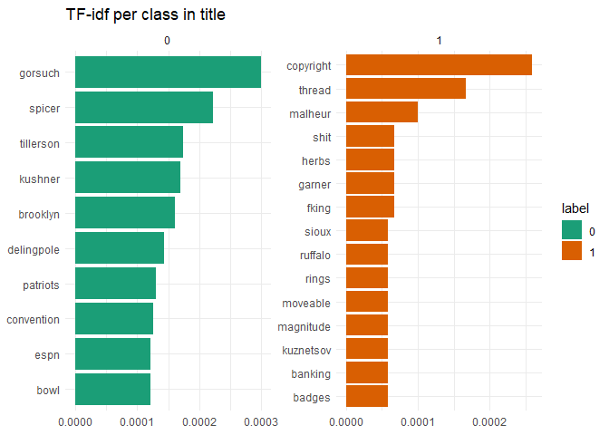

For the final model, I remove the terms which occur in less than 5% of the documents because sparse terms are useless for classifying the majority of the documents. I also calculate the tf\_idf measure for the remaining terms.

``` r
corpus_title = Corpus(VectorSource(pre_title$title))

dtm_title = DocumentTermMatrix(corpus_title)

dtm_title = removeSparseTerms(dtm_title, 0.95)

dtm_title = weightTfIdf(dtm_title, normalize = TRUE)

dtm_title = as.data.frame(as.matrix(dtm_title))

colnames(dtm_title) = paste("title", colnames(dtm_title), sep = "_")
```

**text**

Now, we go to the title. This is the first article before preprocessing.

``` r
full$text[1]
```

    ## [1] "House Dem Aide: We Didn’t Even See Comey’s Letter Until Jason Chaffetz Tweeted It By Darrell Lucus on October 30, 2016 Subscribe Jason Chaffetz on the stump in American Fork, Utah ( image courtesy Michael Jolley, available under a Creative Commons-BY license) \nWith apologies to Keith Olbermann, there is no doubt who the Worst Person in The World is this week–FBI Director James Comey. But according to a House Democratic aide, it looks like we also know who the second-worst person is as well. It turns out that when Comey sent his now-infamous letter announcing that the FBI was looking into emails that may be related to Hillary Clinton’s email server, the ranking Democrats on the relevant committees didn’t hear about it from Comey. They found out via a tweet from one of the Republican committee chairmen. \nAs we now know, Comey notified the Republican chairmen and Democratic ranking members of the House Intelligence, Judiciary, and Oversight committees that his agency was reviewing emails it had recently discovered in order to see if they contained classified information. Not long after this letter went out, Oversight Committee Chairman Jason Chaffetz set the political world ablaze with this tweet. FBI Dir just informed me, \"The FBI has learned of the existence of emails that appear to be pertinent to the investigation.\" Case reopened \n— Jason Chaffetz (@jasoninthehouse) October 28, 2016 \nOf course, we now know that this was not the case . Comey was actually saying that it was reviewing the emails in light of “an unrelated case”–which we now know to be Anthony Weiner’s sexting with a teenager. But apparently such little things as facts didn’t matter to Chaffetz. The Utah Republican had already vowed to initiate a raft of investigations if Hillary wins–at least two years’ worth, and possibly an entire term’s worth of them. Apparently Chaffetz thought the FBI was already doing his work for him–resulting in a tweet that briefly roiled the nation before cooler heads realized it was a dud. \nBut according to a senior House Democratic aide, misreading that letter may have been the least of Chaffetz’ sins. That aide told Shareblue that his boss and other Democrats didn’t even know about Comey’s letter at the time–and only found out when they checked Twitter. “Democratic Ranking Members on the relevant committees didn’t receive Comey’s letter until after the Republican Chairmen. In fact, the Democratic Ranking Members didn’ receive it until after the Chairman of the Oversight and Government Reform Committee, Jason Chaffetz, tweeted it out and made it public.” \nSo let’s see if we’ve got this right. The FBI director tells Chaffetz and other GOP committee chairmen about a major development in a potentially politically explosive investigation, and neither Chaffetz nor his other colleagues had the courtesy to let their Democratic counterparts know about it. Instead, according to this aide, he made them find out about it on Twitter. \nThere has already been talk on Daily Kos that Comey himself provided advance notice of this letter to Chaffetz and other Republicans, giving them time to turn on the spin machine. That may make for good theater, but there is nothing so far that even suggests this is the case. After all, there is nothing so far that suggests that Comey was anything other than grossly incompetent and tone-deaf. \nWhat it does suggest, however, is that Chaffetz is acting in a way that makes Dan Burton and Darrell Issa look like models of responsibility and bipartisanship. He didn’t even have the decency to notify ranking member Elijah Cummings about something this explosive. If that doesn’t trample on basic standards of fairness, I don’t know what does. \nGranted, it’s not likely that Chaffetz will have to answer for this. He sits in a ridiculously Republican district anchored in Provo and Orem; it has a Cook Partisan Voting Index of R+25, and gave Mitt Romney a punishing 78 percent of the vote in 2012. Moreover, the Republican House leadership has given its full support to Chaffetz’ planned fishing expedition. But that doesn’t mean we can’t turn the hot lights on him. After all, he is a textbook example of what the House has become under Republican control. And he is also the Second Worst Person in the World. About Darrell Lucus \nDarrell is a 30-something graduate of the University of North Carolina who considers himself a journalist of the old school. An attempt to turn him into a member of the religious right in college only succeeded in turning him into the religious right's worst nightmare--a charismatic Christian who is an unapologetic liberal. His desire to stand up for those who have been scared into silence only increased when he survived an abusive three-year marriage. You may know him on Daily Kos as Christian Dem in NC . Follow him on Twitter @DarrellLucus or connect with him on Facebook . Click here to buy Darrell a Mello Yello. Connect"

For the text, I use the same preprocessing steps as for the title.

``` r
pre_text = full %>%
  select(label, text) %>%
  mutate(text = gsub("\n", "", text), 
         text = replace_html(text),
         text = replace_url(text, replacement = ""),
         text = replace_non_ascii(text),
         text = replace_contraction(text), 
         text = removeWords(text, stopwords("english")),
         text = removeWords(text, stopwords("german")),
         text = removePunctuation(text),
         text = removeNumbers(text), 
         text = tolower(text),
         text = lemmatize_words(text),
         text = rm_nchar_words(text, "1,2"),
         text = stripWhitespace(text))
```

This is the way the article looks after preprocessing.

``` r
pre_text$text[1]
```

    ## [1] "house dem aide even see comeys letter until jason chaffetz tweeted darrell lucus october subscribe jason chaffetz stump american fork utah image courtesy michael jolley available creative commonsby license with apologies keith olbermann doubt worst person the world weekfbi director james comey but according house democratic aide looks like know secondworst person well turns comey sent nowinfamous letter announcing fbi looking emails may related hillary clintons email server ranking democrats relevant committees hear comey they found via tweet one republican committee chairmen now know comey notified republican chairmen democratic ranking members house intelligence judiciary oversight committees agency reviewing emails recently discovered order see contained classified information not long letter went oversight committee chairman jason chaffetz set political world ablaze tweet fbi dir just informed the fbi learned existence emails appear pertinent investigation case reopened jason chaffetz jasoninthehouse october course now know case comey actually saying reviewing emails light unrelated case now know anthony weiners sexting teenager but apparently little things facts matter chaffetz the utah republican already vowed initiate raft investigations hillary wins least two years worth possibly entire terms worth apparently chaffetz thought fbi already work resulting tweet briefly roiled nation cooler heads realized dud but according senior house democratic aide misreading letter may least chaffetz sins that aide told shareblue boss democrats even know comeys letter time found checked twitter democratic ranking members relevant committees receive comeys letter republican chairmen fact democratic ranking members didn receive chairman oversight government reform committee jason chaffetz tweeted made public let see got right the fbi director tells chaffetz gop committee chairmen major development potentially politically explosive investigation neither chaffetz colleagues courtesy let democratic counterparts know instead according aide made find twitter there already talk daily kos comey provided advance notice letter chaffetz republicans giving time turn spin machine that may make good theater nothing far even suggests case after nothing far suggests comey anything grossly incompetent tonedeaf what suggest however chaffetz acting way makes dan burton darrell issa look like models responsibility bipartisanship even decency notify ranking member elijah cummings something explosive trample basic standards fairness know granted likely chaffetz answer sits ridiculously republican district anchored provo orem cook partisan voting index gave mitt romney punishing percent vote moreover republican house leadership given full support chaffetz planned fishing expedition but mean can turn hot lights after textbook example house become republican control and second worst person world about darrell lucus darrell something graduate university north carolina considers journalist old school attempt turn member religious right college succeeded turning religious rights worst nightmare charismatic christian unapologetic liberal his desire stand scared silence increased survived abusive threeyear marriage you may know daily kos christian dem follow twitter darrelllucus connect facebook click buy darrell mello yello connect"

Here, we also can take a look at the most important terms for each class.

``` r
pre_text %>%
  unnest_tokens(word, text) %>%
  group_by(label) %>%
  count(word) %>%
  bind_tf_idf(word, label, n) %>%
  group_by(label) %>%
  arrange(label, -tf_idf) %>%
  top_n(10, tf_idf) %>%
  ggplot(aes(reorder_within(word, tf_idf, label), tf_idf, fill = as.factor(label))) +
  geom_bar(stat = "identity") +
  facet_wrap(~label, scales = "free") +
  scale_x_reordered() +
  coord_flip() +
  theme_minimal() +
  scale_fill_brewer(palette = "Dark2") +
  labs(x = NULL, y = NULL, fill = "label", title = "TF-idf per class in text")
```

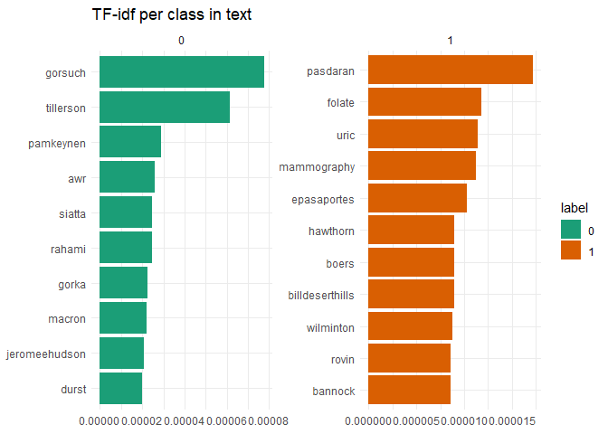

As I did for the title I use only those terms which are less sparse then 5% and calculate the tf\_idf measure.

``` r
corpus_text = Corpus(VectorSource(pre_text$text))

dtm_text = DocumentTermMatrix(corpus_text)

dtm_text = removeSparseTerms(dtm_text, 0.95)

dtm_text = weightTfIdf(dtm_text, normalize = TRUE)

dtm_text = as.data.frame(as.matrix(dtm_text))

colnames(dtm_text) = paste("text", colnames(dtm_text), sep = "_")
```

**Creating the final data set**

Finally, I merge the engineered features to the final data set.

``` r
final = cbind(dtm_text, dtm_title)

final$len_title = len_title$len_title

final$language = as.numeric(full_language_binned$language.binned)

final$author = as.numeric(full_author_binned$author.binned)

final$label = as.factor(full$label)

final$id = full$id

colnames(final) = make.names(colnames(final), unique = T)
```

5 Modeling
==========

**Creating the train and test set partition**

First, I split the data in the original train and test set partition and creating the modeling tasks.

``` r
final_train = final %>% filter(id %in% c(train$id)) %>% select(-id)
final_test = final %>% filter(id %in% c(test$id)) %>% select(-id)

train_task = makeClassifTask(data = final_train, target = "label", positive = "1")
test_task = makeClassifTask(data = final_test , target = "label")
```

**Tuning the model**

For modeling I use XG-Boost.

``` r
xgb = makeLearner("classif.xgboost", par.vals  = list(eta = 0.1))

params = makeParamSet(makeIntegerParam("nrounds",lower = 1,upper = 500),
                      makeIntegerParam("max_depth",lower = 1,upper = 6), 
                      makeNumericParam("subsample",lower = 0.3,upper = 1), 
                      makeNumericParam("colsample_bytree",lower = 0.3,upper = 1))


mbo.ctrl = makeMBOControl()
mbo.ctrl = setMBOControlTermination(mbo.ctrl, iters = 1)
ctrl = makeTuneControlMBO(mbo.control = mbo.ctrl)


set.seed(3)
rdesc = makeResampleDesc("CV", 
                         iters = 5)  


xgb_tune = tuneParams(learner = xgb, 
                      par.set = params,
                      task = train_task, 
                      resampling = rdesc,
                      control = ctrl, 
                      show.info = FALSE,
                      measures = list(acc))

parallelStop()
```

Now, I apply the model to the training data with the tuned hyper parameters.

``` r
lrn_xgb = setHyperPars(xgb, par.vals = xgb_tune$x)

model = train(lrn_xgb, train_task)
```

**Evaluation**

I evaluate the results by calculating the confusion matrix. Overall, there is an accuracy of 99%.

``` r
set.seed(3)
fit_cv = crossval(lrn_xgb, 
                  train_task, 
                  iters = 5, 
                  stratify = TRUE, 
                  show.info = FALSE)
```

``` r
caret::confusionMatrix(fit_cv$pred$data$truth, 
                       fit_cv$pred$data$response, 
                       mode = "prec_recall",
                       positive = "1")
```

    ## Confusion Matrix and Statistics
    ## 
    ##           Reference
    ## Prediction     0     1
    ##          0 10385     2
    ##          1    10 10403
    ##                                               
    ##                Accuracy : 0.9994              
    ##                  95% CI : (0.999, 0.9997)     
    ##     No Information Rate : 0.5002              
    ##     P-Value [Acc > NIR] : < 0.0000000000000002
    ##                                               
    ##                   Kappa : 0.9988              
    ##  Mcnemar's Test P-Value : 0.04331             
    ##                                               
    ##               Precision : 0.9990              
    ##                  Recall : 0.9998              
    ##                      F1 : 0.9994              
    ##              Prevalence : 0.5002              
    ##          Detection Rate : 0.5001              
    ##    Detection Prevalence : 0.5006              
    ##       Balanced Accuracy : 0.9994              
    ##                                               
    ##        'Positive' Class : 1                   
    ## 

If we look at the feature importance the author and the source (i.e. "The New York Times" or "Breitbart News Network" in the title) are the most important features for predicting unreliable news.

``` r
imp =  getFeatureImportance(model)

imp = melt(imp$res[, 2:ncol(imp$res)])

imp = imp %>% arrange(-value)

imp %>%
  slice(1:20) %>%
  ggplot(aes(x = reorder(variable, value), y = value)) +
  geom_bar(stat = "identity", fill = "#d95f0e") +
  labs(x = "Features", y = "Permutation Importance") +
  coord_flip() +
  theme_minimal()
```

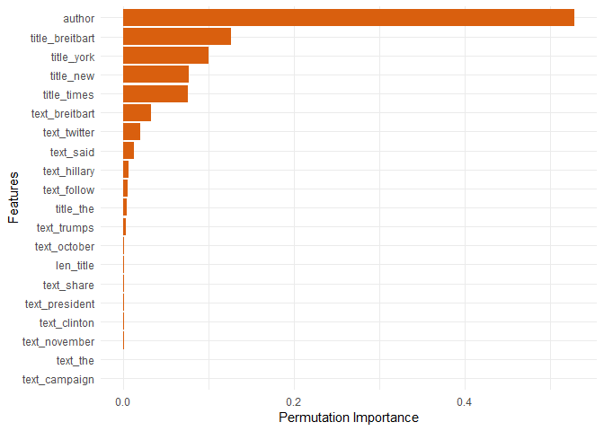

6 Submission
============

Finaly, I apply the model to the test data and make the submission.

``` r
pred = predict(model, test_task)

submit = data.frame(id = test$id, label = pred$data$response)

write.csv(submit, file = "submit.csv", row.names = FALSE)
```
